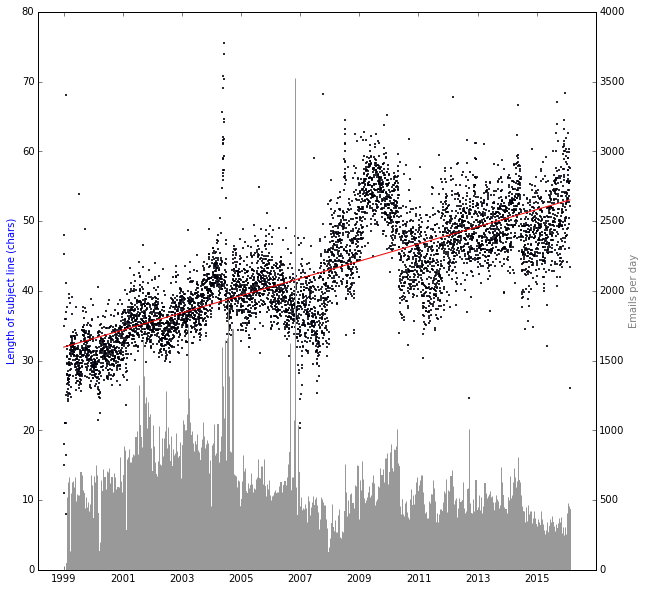

Subject line growth over the years -- a qualitative approach
============================================================

This code accompanies a blog post at <http://www.oblomovka.com/wp/2016/02/17/are-email-subject-lines-getting-longer/>

Summary:
I noticed that the subject lines from my inbox circa 1998 seem, on average,
shorter than the subject lines of emails I receive today (2016).

In my email corpus, there seems to be a general upward trend in email subject
length: the subject line grows, on average, more than one character per year.

This means that by the year 2036, the average email subject line will be eighty
characters, and no longer be able to fit across an 80-character VT100 terminal.
Chaos will ensue.

Here are some tools I wrote to help me conduct this vital analysis:

| Program | Function |
--- | --- |
| bring\_me\_emails.py | Can slurp up and save stats of emails stored
in mbox, Maildir or notmuchmail. |
| strip_ids.py | Can remove personal info (message-ids) from a sqlite3 database
created by bring_me_emails.py |
| Subject line growth-sqlite-scatter.ipynb | Create a scatter plot of email
subject line length (ipython/jupyter notebook) |
| plotlengths.py | Plot scatter plot and save as a PNG file from the command
line |

You'll need the [matplotlib](http://matplotlib.org/users/installing.html)
libraries to use the plotlengths.py script, and
[Jupyter/ipython](http://jupyter.readthedocs.org/en/latest/install.html) to run
the ipython notebook. If you want to read mail stored in notmuch, you'll need
its accompanying [python library](https://pypi.python.org/pypi/notmuch/).

An example email database (115MB, stripped of personal info) is [available
separately](https://archive.org/details/emailsubjectlinelengths)
[(torrent)](https://archive.org/download/emailsubjectlinelengths/emailsubjectlinelengths_archive.torrent)

----

Questions, queries? Mail me at [danny@spesh.com](mailto:danny@spesh.com) with
the subject line "Hello Danny, I do hope this subject line won't ruin your
future averages for any subsequent analysis that you have planned". Thanks!
